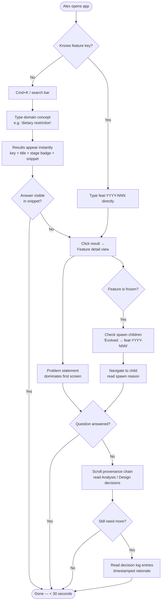
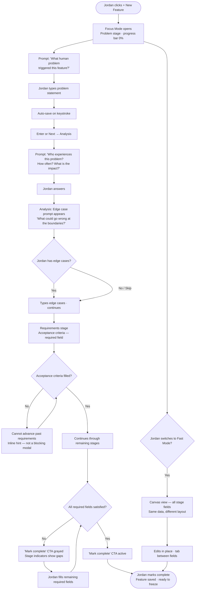
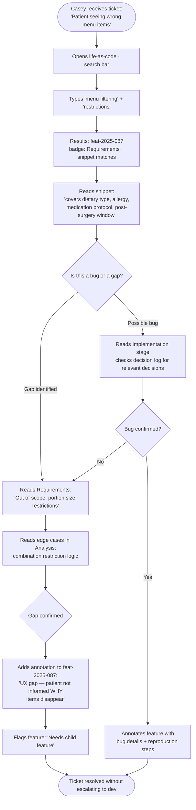
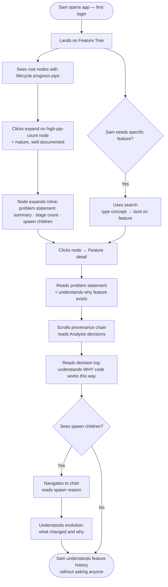

# UX Design Specification bmad

**Author:** Marc\_
**Date:** 2026-03-14

---

<!-- UX design content will be appended sequentially through collaborative workflow steps -->

## Executive Summary

### Project Vision

life-as-code is a provenance layer for software intent — a new product category that sits between PM tools, code hosting, and documentation as the connective tissue linking a human problem to shipped code. The core thesis: "bad communication" in software teams is an information architecture failure. The product makes intent traceable, immutable, and retrievable by anyone on the team in under 30 seconds.

### Target Users

Five distinct mental models served by one product:

| User             | Core Need                                    | Primary Entry Point                |
| ---------------- | -------------------------------------------- | ---------------------------------- |
| Alex (Developer) | "Why does this code exist?"                  | Search → feature detail → raw JSON |
| Jordan (PM)      | Guided definition that forces good thinking  | Wizard (Focus Mode default)        |
| Casey (Support)  | Understand feature intent without escalating | Search → provenance chain          |
| Sam (New Hire)   | Understand product history fast              | Feature tree                       |
| Marc\_ (Admin)   | Schema config, templates, usage monitoring   | Admin panel                        |

### Key Design Challenges

1. **One product, five mental models** — same data, radically different needs. The UX must feel native to each role without fragmenting into separate apps.
2. **The wizard must feel like a thinking partner, not a form** — this is the core value proposition made visible. If it feels like bureaucratic field-filling, the product fails its own thesis.
3. **Immutability + lineage is a novel mental model** — users have never seen "frozen features that spawn children." Frozen state, parent-child relationships, and spawn reasons must be immediately legible without a tutorial.
4. **Fast Mode / Focus Mode switching** — same feature, two views. Transition must feel seamless and never destructive.

### Design Opportunities

1. **The provenance chain as a story** — feature detail views can be genuinely beautiful to read: a narrative arc from human problem through every decision to shipped code.
2. **Search as a power user home** — for Alex and Casey, search may be the most-used entry point. Instant, context-rich results could be the product's most felt differentiator.
3. **The feature tree as onboarding artifact** — if the tree communicates product history at a glance, a new hire can orient in minutes instead of weeks.

### Core Design Principles

- **"Show everything, overwhelm nothing"** — required fields visible and weighted, standard fields present but quiet, extended/custom fields collapsed by default.
- **Fast Mode + Focus Mode** — two wizard views serving the same data. Fast = full stage canvas, all fields, edit in place. Focus = one question at a time, human-language prompts, sequential navigation. Toggle persisted to localStorage. Focus Mode is the default for new users.
- **Frozen = trustworthy, not locked** — visual language must communicate that frozen features are the gold standard: complete, immutable, reliable.
- **Mode belongs to the task, not the role** — any user can use either mode.

## Core User Experience

### Defining Experience

The product has two interlocking loops:

- **Creation loop** (wizard): capture the full "why" behind a feature before code is written
- **Retrieval loop** (search + provenance chain): find the "why" in under 30 seconds

The wizard is the make-or-break interaction — no great provenance in means no great provenance out. But the conversion moment happens in the retrieval loop: the first time someone finds their answer without asking three people.

### Platform Strategy

- **Web app, desktop-first** — mouse + keyboard primary interaction model
- **No mobile, no offline** for MVP
- **Keyboard navigability required** across all core workflows (WCAG 2.1 Level A)
- **Auto-save throughout** — no wizard state should ever require a manual save to persist

### Effortless Interactions

| Interaction                   | Design Target                                                                            |
| ----------------------------- | ---------------------------------------------------------------------------------------- |
| Wizard auto-save              | Progress saves silently on every field change — no "save" button anxiety                 |
| Mode switching (Fast ↔ Focus) | One click, zero data loss, preference remembered                                         |
| Search                        | Type a concept, get results with provenance snippets — no required filters for first hit |
| Feature spawn                 | Two clicks from a frozen feature, parent context pre-loaded                              |
| Frozen state recognition      | Immediately legible at a glance without reading labels                                   |

### Critical Success Moments

1. **The PM's first "I hadn't thought of that"** — Focus Mode surfaces an edge case that would have been missed. The wizard proves its thesis.
2. **The dev's first 30-second "why" lookup** — Alex searches a concept, reads the provenance chain, understands code he didn't write. First conversion moment.
3. **The new hire's first solo answer** — Sam navigates the feature tree and resolves his own onboarding question without asking anyone.
4. **The first successful spawn** — a frozen feature spawns a child with clear lineage. The immutability model clicks: "you don't edit, you evolve."

### Experience Principles

1. **The wizard earns every field it asks for** — every prompt must justify its existence by surfacing a question the user wouldn't have asked themselves.
2. **Retrieval is the proof** — the creation experience is only worth it if the retrieval experience delivers. Design both as if the other depends on it.
3. **Auto-save everything, confirm nothing** — progress is never lost. The user's only job is to think, not to manage state.
4. **Legibility over labels** — frozen state, lifecycle progress, lineage relationships must be visually obvious before a user reads a single word.

## Desired Emotional Response

### Primary Emotional Goals

**Primary:** Clarity + Relief — the tension of not knowing resolves instantly. The product's core emotional job is to replace low-grade frustration ("I have to ask someone") with immediate understanding ("it's all here").

**Secondary:** Empowerment — users feel like they have context others don't, and got it in seconds. This is the emotion that drives word-of-mouth adoption.

### Emotional Journey Mapping

| Moment                           | Target Emotion                         | Emotion to Avoid            |
| -------------------------------- | -------------------------------------- | --------------------------- |
| First open / onboarding          | Curious, not overwhelmed               | Intimidated                 |
| Creating first feature           | Engaged, thinking deeply               | Burdened                    |
| Focus Mode surfaces an edge case | Pleasantly surprised ("good catch")    | Annoyed                     |
| Fast Mode                        | Efficient, in control                  | Confused                    |
| Search                           | Anticipation → satisfaction            | Anxiety                     |
| Reading a provenance chain       | Clarity, narrative flow                | Wall-of-text fatigue        |
| Viewing the feature tree         | Oriented, grounded                     | Lost                        |
| Spawning a child feature         | Purposeful, building something lasting | Uncertain                   |
| Hitting a frozen feature         | Respect for the record                 | Frustrated at being blocked |

### Micro-Emotions

- **Confidence over confusion** — at every step, users know where they are and what's expected
- **Trust over skepticism** — data must feel authoritative, never stale
- **Accomplishment over frustration** — completing a lifecycle stage feels like progress, not paperwork
- **Curiosity over anxiety** — empty fields invite exploration, not pressure

### Design Implications

- **Clarity → provenance chain as narrative** — stage-by-stage storytelling with clear visual hierarchy, not a list of filled fields
- **Relief → search result snippets** — show the answer in the result, not just a link to where the answer might be
- **Empowerment → instant context** — feature detail views lead with the problem statement and key decisions, not metadata
- **Accomplishment → stage completion feedback** — subtle visual confirmation when a stage reaches meaningful completeness
- **Trust → frozen state visual language** — frozen features look solid, authoritative, gold-standard — not greyed out or disabled

### Emotional Design Principles

1. **Every interaction must make the user smarter, not slower** — the product earns its place in the workflow by delivering insight, not demanding input.
2. **Eliminate overhead guilt** — no interaction should feel like paperwork. Focus Mode prompts must feel like good questions from a smart colleague.
3. **Resolve uncertainty immediately** — loading states, empty states, and error states must orient the user instantly. Confusion is the enemy.
4. **Let the data speak** — the provenance chain is the emotional centerpiece. Design it to be genuinely readable, not just technically complete.

## UX Pattern Analysis & Inspiration

### Inspiring Products Analysis

**Linear** — developer-facing productivity; speed as a design value, visual status language, structured data that doesn't feel like a form.

**GitHub Pull Requests** — the closest existing model to feature provenance; immutability as trust, conversation-as-provenance timeline, bidirectional lineage linking, color semantics for state (merged = purple = celebrated).

**Typeform** — the gold standard for Focus Mode interaction; one question fills the screen, human-language prompts, Enter-to-advance, felt momentum over step counts.

**Figma (mode switching)** — persistent mode toggle in top bar, each mode has a clear purpose signal, no data loss anxiety when switching, instant smooth transitions.

**Notion (progressive complexity)** — toggle pattern for hiding/showing depth, empty state as invitation not failure, properties panel for metadata separation.

### Transferable UX Patterns

**Navigation & Status:**

- Color + icon for feature state (active / frozen / draft) — never text labels alone
- Command palette (`Cmd+K`) for Fast Mode power users
- Bidirectional lineage links — parent ↔ child, always navigable

**Wizard / Focus Mode:**

- Single question fills the screen — nothing competes with the current prompt
- Human-language prompts ("What human problem triggered this?") not field labels ("Problem Statement \*")
- Enter-to-advance keyboard behavior throughout
- Thin progress bar at top — felt momentum, not step counting
- Toggle pattern for extended fields — collapsed by default, expand inline

**Mode Switching:**

- Persistent ⚡ Fast / 🎯 Focus toggle in wizard shell top bar
- Visual character shift between modes — canvas vs. conversation
- Instant transition, no data loss, preference persisted

**Empty States:**

- Empty fields as invitation ("Start here...") not failure ("Required")
- Empty feature tree = "Create your first feature" with clear CTA
- Empty search = suggestions, not a void

### Anti-Patterns to Avoid

- **Jira's field-as-bureaucracy model** — never make optional fields feel mandatory through visual weight
- **Asterisk-driven required field anxiety** — use visual weight (filled background, clear label) not asterisks alone
- **Step number dread** ("Step 4 of 12") — use a progress bar, not a counter
- **Save button anxiety** — auto-save silently; never make the user manage state
- **Text-only status labels** — state must be recognizable before it's readable
- **Wall-of-text provenance** — the feature detail view must have strong visual hierarchy or it becomes Confluence

### Design Inspiration Strategy

**Adopt directly:**

- Linear's visual status language for feature states
- Typeform's single-question Focus Mode layout and prompt style
- GitHub's frozen = committed (not locked) mental model and color semantics
- Figma's top-bar mode toggle pattern
- Notion's toggle/collapse for extended fields

**Adapt for life-as-code:**

- GitHub's PR timeline → feature decision log with similar chronological, append-only treatment
- Notion's empty-state-as-invitation → wizard prompts that feel like starting a conversation
- Linear's command palette → consider for MVP or v2 Fast Mode power users

**Avoid entirely:**

- Jira's ticket mental model and field-as-form aesthetic
- Confluence's unstructured document approach to provenance
- Any pattern that creates "save anxiety" or "step dread"

## Defining Core Experience

### Defining Experience

> **"The moment the wizard asks the question you hadn't asked yourself."**

The defining interaction is the Focus Mode wizard's first live prompt — the system responds to the user's problem statement by surfacing the question they almost certainly hadn't considered yet. This is the product's thesis made tangible: a thinking partner, not a form.

Secondary defining experience: **the 30-second "why" lookup** — searching a concept, landing on a provenance chain, reading the answer without asking anyone. This is the moment that converts skeptics and drives word-of-mouth.

### User Mental Model

Users arrive with document-centric mental models:

- PMs: "I write a spec once and it's done"
- Devs: "The ticket tells me what to build"
- Support: "I ask the person who built it"
- New hires: "I read docs until I understand"

**The shift life-as-code must create:** a feature file is a living record of intent, not a one-time artifact. Returning to update it is part of the workflow, not homework.

**Key friction to design around:** Users are conditioned to write documentation once and abandon it. Every interaction that makes updating feel effortless (auto-save, Fast Mode quick edits, inline annotation) reduces the activation energy for the habit.

### Success Criteria

- User completes first feature creation in < 15 minutes (Focus Mode, standard completion)
- At least one wizard step surfaces a question the user hadn't considered
- "Why" lookup resolves in < 30 seconds from search to answer
- Mode switching (Fast ↔ Focus) happens without anxiety about data loss
- Frozen state is understood on first encounter without reading help text
- Spawn dialog makes the immutability model click without explanation

### Novel UX Patterns

Two novel patterns require in-context teaching (not tutorials):

**1. Immutability + Spawn**
Novel: users expect to edit existing records, not spawn children.
Teaching moment: when a user first attempts to edit a frozen feature, the UI intercepts with: _"This feature is frozen — its record is permanent. Want to evolve it? Spawn a child feature that links back to this one."_ with a single CTA. The explanation happens at the moment of need, not upfront.
Familiar metaphor: git branches — "you don't rewrite history, you branch from it."

**2. Provenance Chain as Timeline**
Novel: users expect a form with fields, not a narrative timeline.
Teaching moment: the feature detail view leads with the problem statement in large type — unmistakably the "root node" — followed by a visual timeline of stages. The structure communicates its own meaning before any labels are read.
Familiar metaphor: a GitHub PR thread — chronological, append-only, the story of how something came to be.

### Experience Mechanics

**Core Flow 1 — Feature Creation (Focus Mode):**

1. **Initiation:** "New Feature" CTA from any screen. Lands in Focus Mode by default for first-time users (Fast Mode for returning users who've switched preference).
2. **Interaction:** Stage-by-stage prompts. Each prompt is a full-sentence question. User types freely. Enter advances. Progress bar fills silently. Auto-save on every keystroke. Extended fields collapsed, available via "Show more ▾".
3. **Feedback:** Stage completion indicator updates as fields gain substance. Required fields show a subtle filled state when satisfied — no blocking errors unless user tries to mark complete with required fields empty.
4. **Completion:** "Mark complete" CTA appears when required fields are satisfied. Confirmation: "Feature saved. Ready to freeze when implementation is done."

**Core Flow 2 — "Why" Lookup (Search):**

1. **Initiation:** Search bar prominent in nav. `Cmd+K` from anywhere.
2. **Interaction:** Type a concept. Results appear instantly (debounced, no submit). Each result shows: feature key, title, matching stage, 2-line context snippet.
3. **Feedback:** Highlighted match terms. Stage badge shows where the match was found.
4. **Completion:** Click result → feature detail view. Problem statement leads. Answer is visible within the first screen — no scrolling required for the "why."

**Core Flow 3 — Spawn Child Feature:**

1. **Initiation:** "Evolve this feature" button on frozen feature detail view. Also intercepts edit attempts on frozen features.
2. **Interaction:** Spawn dialog: parent feature shown at top (read-only context). Single required field: "Why is this evolving?" (spawn reason). Pre-populated fields inherit parent's tags and domain context.
3. **Feedback:** New feature created with `linked_from` set to parent. Feature key generated. Tree updates to show new child node.
4. **Completion:** Lands in wizard for new child feature, parent context visible in sidebar. Lineage is established — the chain continues.

## Design System Foundation

### Design System Choice

**Component Library:** shadcn/ui (Radix UI primitives + copy-paste architecture)
**Styling Engine:** Tailwind CSS v4
**Approach:** Themeable system — strong accessible foundation with full visual ownership. shadcn/ui provides no default aesthetic; life-as-code defines its own.

⚠️ **Compatibility note:** Verify shadcn/ui component availability on Tailwind v4 before assuming full catalogue — flag for first implementation story.

### Rationale for Selection

- **Accessible by default** — Radix UI primitives satisfy WCAG 2.1 Level A (NFR20) without additional work
- **No visual lock-in** — shadcn/ui has no default theme; the visual language is entirely ours to define
- **Developer-native** — Alex recognizes and trusts this stack; it signals craft
- **Token-driven theming** — all visual mode combinations and custom themes are token swaps, not component rewrites

### Three-Layer Visual System

Users control three independent preferences, each persisted to localStorage:

| Layer                | Options                              | Effect                      |
| -------------------- | ------------------------------------ | --------------------------- |
| **Brightness**       | Dark / Light                         | Surface + text contrast     |
| **Visual character** | Code-like / Human-like               | Density, radius, typography |
| **Theme / Accent**   | Preset palettes (+ custom picker v2) | Accent + interactive color  |

All combinations are valid. Total: 2 × 2 × N themes supported.

### Implementation Approach

**CSS variable token sets per layer:**

_Brightness tokens:_

- `--color-surface`, `--color-surface-raised`, `--color-text`, `--color-text-muted`

_Visual character tokens:_

- `--radius`: 2px (Code) / 10px (Human)
- `--font-family-prose`: tight sans (Code) / generous sans (Human)
- `--line-height-prose`: 1.4 (Code) / 1.75 (Human)
- `--spacing-density`: compact scale (Code) / airy scale (Human)
- `--color-border`: precise border (Code) / subtle shadow (Human)

_Theme / accent tokens:_

- `--color-accent`, `--color-accent-hover`, `--color-accent-subtle`
- `--color-focus-ring`
- Applied to: buttons, links, active states, focus rings, selected items

**MVP: Preset themes** — 6–8 curated accent palettes, all verified to work across all brightness + character combinations:

| Theme            | Accent        | Feel                  |
| ---------------- | ------------- | --------------------- |
| Indigo (default) | Indigo/violet | Professional, focused |
| Emerald          | Green         | Fresh, positive       |
| Rose             | Pink/red      | Bold, energetic       |
| Amber            | Orange/yellow | Warm, creative        |
| Cyan             | Teal/sky      | Cool, technical       |
| Slate            | Neutral gray  | Minimal, no-accent    |

**Post-MVP:** Full HSL color picker for custom accent, with contrast validation to ensure accessibility is maintained.

### Feature State Colors (Fixed — Not Themeable)

Status semantics remain constant across all themes to preserve legibility:

| Token                     | State             | Color  |
| ------------------------- | ----------------- | ------ |
| `--color-feature-active`  | In-progress       | Blue   |
| `--color-feature-frozen`  | Frozen / complete | Purple |
| `--color-feature-draft`   | Draft             | Gray   |
| `--color-feature-flagged` | Needs attention   | Amber  |

These are informational signals, not decoration — they must be consistent and immediately recognizable regardless of the user's chosen theme.

### Theme Controls Placement

- Persistent controls in app header or user settings panel
- All three toggles accessible from any screen
- Changes apply instantly (token swap = no page reload)
- Preferences persisted to localStorage per device

## Visual Design Foundation

### Color System

**Architecture:** Four base mode combinations (Code/Human × Dark/Light) via CSS variable token swap. Accent theme layered independently on top.

**Base surfaces:**

| Mode        | Surface   | Surface raised | Text      | Text muted | Border    |
| ----------- | --------- | -------------- | --------- | ---------- | --------- |
| Code Dark   | zinc-950  | zinc-900       | zinc-100  | zinc-400   | zinc-800  |
| Code Light  | white     | zinc-50        | zinc-900  | zinc-500   | zinc-200  |
| Human Dark  | stone-950 | stone-900      | stone-100 | stone-400  | stone-800 |
| Human Light | stone-50  | white          | stone-900 | stone-500  | stone-200 |

**Default accent — Indigo:**
`indigo-500/600` for interactive elements, `indigo-950/50` or `indigo-50` for subtle backgrounds. All presets verified for WCAG AA contrast.

**Feature state colors (fixed, all modes):**
Active = blue · Frozen = purple · Draft = gray · Flagged = amber

### Typography System

**Font stack:**

- UI + prose: Inter (or Geist) — adapts weight and scale per mode
- Data + code: JetBrains Mono (or Geist Mono) — fixed across all modes. Feature keys and JSON content always render in monospace — visual signal that these are data, not prose.

**Scale per visual character:**

| Role               | Code-like              | Human-like              |
| ------------------ | ---------------------- | ----------------------- |
| Feature title      | 20px / semibold        | 24px / semibold         |
| Section heading    | 14px / medium / caps   | 18px / medium           |
| Body / prompt      | 14px / 1.4 line-height | 16px / 1.75 line-height |
| Metadata           | 12px / medium          | 13px / regular          |
| Feature key / JSON | 12–13px monospace      | 12–13px monospace       |

### Spacing & Layout Foundation

**Base unit:** 8px grid throughout.

**Density per visual character:**

| Token             | Code-like | Human-like |
| ----------------- | --------- | ---------- |
| Component padding | 8–12px    | 12–20px    |
| Section spacing   | 16–24px   | 24–40px    |
| List item gap     | 4px       | 8px        |
| Card padding      | 12px      | 20px       |

**App shell layout:**

- Fixed header: 48px — theme controls, search (`Cmd+K`), primary nav
- Left sidebar: 240px (collapsible to 48px icon rail for focus)
- Main content: fluid, max 800px for wizard/detail, full-width for tree/search
- No column grid — 8px spatial tokens for consistent rhythm

### Accessibility Considerations

- All base mode surface/text combinations meet WCAG AA (4.5:1 minimum)
- All preset accent themes verified for 3:1 contrast on interactive elements
- Focus rings: `--color-accent` at full opacity, 2px solid, 2px offset — always visible
- Custom accent picker (post-MVP): real-time contrast ratio display, blocks save if below WCAG AA
- Minimum touch/click target: 32px x 32px across all components (shadcn/ui default)

## Design Direction Decision

### Design Directions Explored

Six directions explored across Code/Human × Dark/Light × accent combinations:

- A: Operator Dark (Code · Dark · Indigo) — feature detail / provenance chain
- B: Studio Light (Human · Light · Indigo) — Focus Mode wizard
- C: Terminal Focus (Code · Dark · Cyan) — Fast Mode canvas
- D: Warm Workspace (Human · Light · Amber) — feature tree / onboarding
- E: Midnight (Human · Dark · Rose) — search results
- F: Minimal Light (Code · Light · Slate) — admin / schema config

Full interactive showcase: `_bmad-output/planning-artifacts/ux-design-directions.html`

### Chosen Direction: "Dark Operator" (Synthesis of A + C + E)

A synthesized direction drawing specific strengths from three directions:

**From A — Typographic readability:**
Strong weight contrast, monospace feature keys as distinct data markers, provenance chain as stage-dot timeline with narrative text blocks. Readability through contrast and weight, not whitespace alone.

**From C — Structural certainty:**
Clear stage-tab navigation, organized field groups with explicit labels, persistent footer with save indicator + prev/next navigation. The "here's where you are, here's what goes here" clarity.

**From E — Warm dark palette:**
Stone-950/900 surfaces (warm dark, not cold zinc), stone-100/400 text (warm white), rose accent — warmer and more readable than cold indigo in extended dark mode use.

### Design Rationale

| Layer      | Decision                               | Rationale                                                                  |
| ---------- | -------------------------------------- | -------------------------------------------------------------------------- |
| Surfaces   | stone-950 / stone-900                  | Warm dark reduces eye strain vs. cold zinc; matches E's proven readability |
| Text       | stone-100 / stone-400                  | Warm white reads better in low-light environments where devs work          |
| Accent     | rose-400 (slightly muted)              | Warm, distinctive, readable — rose-500 too aggressive for extended use     |
| Typography | Strong weight contrast, monospace data | A's hierarchy makes provenance chains scannable without hunting            |
| Stage nav  | Clear tabs + field groups              | C's structure gives the "can't miss a step" confidence users need          |
| Save/nav   | Persistent footer                      | Always-visible progress prevents "did that save?" anxiety                  |

**Feature state colors remain fixed across all themes:**
Active = blue · Frozen = purple · Draft = gray · Flagged = amber

### Implementation Approach

Base CSS variables for the Dark Operator direction:

```css
--bg: #1c1917; /* stone-950 */
--bg-raised: #292524; /* stone-900 */
--text: #f5f5f4; /* stone-100 */
--text-muted: #a8a29e; /* stone-400 */
--border: #44403c; /* stone-700 */
--accent: #fb7185; /* rose-400 */
--accent-subtle: rgba(251, 113, 133, 0.12);
--radius-code: 2px;
--radius-human: 10px;
```

This is the **default visual direction**. All six preset themes and both visual character modes remain available via the three-layer toggle system — Dark Operator is the first impression, not a constraint.

## User Journey Flows

### Journey 1: Alex — "Why does this code exist?"

Alex is debugging code he didn't write and needs context fast. Entry: any screen via Cmd+K or search bar in header.



**Key UX decisions:**

- Results appear without pressing Enter (debounced)
- Snippet shows matching text in context — answer before clicking
- Feature detail leads with problem statement, not metadata
- Frozen badge + spawn link immediately visible — no hunting for lineage

---

### Journey 2: Jordan — Feature Creation (Focus Mode)

Jordan creates a new feature before any code is written. Entry: "New Feature" button, lands in Focus Mode by default.



**Key UX decisions:**

- Focus Mode default for new users, Fast Mode for returning preference
- Edge case prompt appears contextually in Analysis — not a separate screen
- Required field enforcement is non-blocking until "Mark complete" is attempted
- Mode switch at any point — zero data loss, preference remembered

---

### Journey 3: Casey — Support Ticket Resolution

Casey receives a ticket and needs to understand feature intent without escalating. Entry: search bar from any screen.



**Key UX decisions:**

- Search results show stage badge — Casey sees "Requirements" before clicking
- Annotations are inline — no separate "add comment" flow
- Flag for attention is a single click — creates actionable signal for PM/dev
- Support resolution happens entirely in read mode — no editing required

---

### Journey 4: Sam — New Hire Onboarding

Sam joins Monday, assigned to extend an existing system. Entry: feature tree (linked from onboarding doc or shown on first login).



**Key UX decisions:**

- Lifecycle progress pips guide Sam toward mature features first
- Node inline expand gives enough context to decide "worth reading fully"
- Provenance chain + decision log together answer "why does this code exist"
- No onboarding tutorial — the tree is self-explanatory through visual design

---

### Journey Patterns

**Navigation patterns (consistent across all journeys):**

- `Cmd+K` from anywhere → search — never more than one keystroke from retrieval
- Breadcrumb: `Features / feat-2025-087 / Analysis` — always oriented
- Sidebar tree always visible (or collapsible) — context never fully hidden
- Back navigation preserves scroll position — no losing your place

**Decision patterns:**

- Required field gates are soft until "Mark complete" — never block mid-flow
- Frozen feature edit attempt → intercept with spawn offer, not an error
- Mode switch (Fast ↔ Focus) never requires confirmation — instant, reversible
- Stage navigation is non-linear — users can jump to any stage at any time

**Feedback patterns:**

- Auto-save indicator: persistent footer dot (green = saved, amber = saving)
- Stage completion: pip fills progressively as fields gain substance
- Search: results appear during typing, no submit required
- Spawn: new feature key shown immediately — confirmation is the new screen
- Annotation: appears inline immediately, no page reload

### Flow Optimization Principles

1. **Zero dead-ends** — every state has a clear next action. Frozen feature → spawn. Empty search → suggestions. Empty tree → create first feature CTA.
2. **Retrieval in ≤ 2 clicks** — search result snippet → feature detail. Never more than two interactions from query to answer.
3. **Creation without anxiety** — auto-save every keystroke, mode switch without loss, stage navigation without gates. Users think, not manage state.
4. **Annotation as first-class** — Casey's annotation flow is as fast as reading. Inline, one submit, no modal.
5. **Tree as orientation, search as retrieval** — two complementary entry points. Tree for exploration. Search for known targets.

## Component Strategy

### Design System Components (shadcn/ui — used as-is or lightly themed)

| Component        | Used for                                         |
| ---------------- | ------------------------------------------------ |
| Button           | All CTAs, mode toggles, nav actions              |
| Input / Textarea | Wizard field inputs (Fast Mode)                  |
| Dialog / Modal   | Spawn dialog shell, confirmation overlays        |
| Tabs             | Stage navigation tabs in wizard                  |
| Badge            | Base for FeatureStateBadge                       |
| Tooltip          | Field hints, truncated label explanations        |
| Toast            | Save confirmation, error notifications           |
| Dropdown Menu    | Theme switcher, filter menus                     |
| Skeleton         | Loading states for tree nodes and search results |
| Separator        | Section dividers throughout                      |
| ScrollArea       | Sidebar tree, provenance chain, search results   |

### Custom Components

#### FeatureStateBadge

**Purpose:** Communicate frozen/active/draft/flagged state at a glance before any text is read.
**Anatomy:** Icon + label. Icon alone when space is constrained (tree nodes).
**States:** `frozen` (purple · ✦) · `active` (blue · ●) · `draft` (gray · ○) · `flagged` (amber · ⚑)
**Variants:** `full` (icon + label) · `compact` (icon only) · `dot` (6px pip only)
**Accessibility:** `aria-label="Feature status: frozen"` on compact/dot variants
**Fixed:** Colors are not themeable — semantic signal must be consistent across all themes

---

#### StageCompletionIndicator (Lifecycle Pips)

**Purpose:** Communicate at a glance how complete a feature's lifecycle is.
**Anatomy:** 5 pips representing filled / empty stages (9 stages compressed to 5 groups).
**States:** `filled` (accent color) · `empty` (border color)
**Variants:** `row` (horizontal, tree nodes) · `detail` (labeled, feature detail header)
**Accessibility:** `aria-label="3 of 9 lifecycle stages complete"`

---

#### FeatureCard

**Purpose:** Scannable feature summary for list views and search results.
**Anatomy:** Feature key (monospace) + title + FeatureStateBadge + StageCompletionIndicator + metadata row (author, date, tags)
**States:** `default` · `hover` (border highlight) · `selected` (accent border)
**Variants:** `compact` (list view) · `full` (search result with snippet)
**Accessibility:** Full card is a focusable/clickable region. `role="article"`, `aria-label="{title} — {status}"`

---

#### TreeNode

**Purpose:** Feature tree node with inline expand for context without navigation.
**Anatomy:** Expand toggle + feature key + title + FeatureStateBadge + StageCompletionIndicator
**Expanded state:** Adds problem statement summary + stage count + spawn children count + "View full feature →" CTA
**States:** `collapsed` · `expanded` · `selected` · `loading` (skeleton)
**Variants:** `root` (no indent) · `child` (indented + left border connector)
**Accessibility:** `aria-expanded`, keyboard expand/collapse via Enter/Space, arrow key navigation (react-arborist built-in)

---

#### ProvenanceChain

**Purpose:** Display a feature's full lifecycle as a readable narrative timeline.
**Anatomy:** Vertical timeline. Each stage: dot (filled=complete, empty=not started) + stage name + content area + optional DecisionLogEntry components.
**States:** `complete` · `empty` ("Not yet documented" placeholder) · `collapsed` (summary only)
**Interaction:** Stages collapse/expand inline. "Show all stages" toggle for empty stages.
**Accessibility:** `role="list"`, each stage `role="listitem"` with `aria-label="Stage: Analysis — complete"`

---

#### DecisionLogEntry

**Purpose:** Display a single timestamped decision with what/why/alternatives.
**Anatomy:** Left accent border + "Decision" label + decision text + metadata (author, timestamp)
**States:** `default` · `expanded` (shows alternatives-considered, post-MVP)
**Variants:** `inline` (within ProvenanceChain) · `standalone` (decision log page, post-MVP)
**Accessibility:** `role="article"`, timestamp in `<time>` element

---

#### WizardShell

**Purpose:** Container for the entire wizard experience — mode toggle, stage nav, progress, footer.
**Anatomy:** Progress bar (top, 2px) + mode toggle (⚡/🎯, top-right) + stage tabs + main content area + footer (SaveIndicator + prev/next)
**States:** `focus-mode` · `fast-mode` (content area renders different child component)
**Persistence:** Mode preference saved to localStorage via WizardStore
**Accessibility:** Stage tabs `role="tablist"`, progress bar `role="progressbar"` with `aria-valuenow`

---

#### WizardStep — Focus Mode

**Purpose:** Single-question full-screen layout. One prompt, one answer field, nothing else.
**Anatomy:** Stage label (small caps) + prompt (large, bold) + hint text + textarea + enter-to-advance hint + prev/next buttons
**States:** `empty` · `has-content` (Next CTA active) · `required-unsatisfied` (soft visual, not blocking)
**Keyboard:** Enter = advance. Shift+Enter = newline in textarea.
**Accessibility:** Textarea `aria-describedby` pointing to prompt + hint. Focus on question on stage load.

---

#### WizardStep — Fast Mode

**Purpose:** Full stage canvas with all fields visible, organized by field group.
**Anatomy:** Two columns of field groups. Label + required indicator + textarea/input. "Show extended fields ▾" toggle at bottom.
**States:** `default` · `field-focused` · `field-filled` (subtle filled border)
**Keyboard:** Tab between fields, Shift+Tab backwards.
**Accessibility:** Each field group `role="group"` with `aria-labelledby` pointing to label

---

#### SpawnDialog

**Purpose:** Create a child feature from a frozen parent. Teaches the immutability model at the moment of need.
**Anatomy:** Parent feature context panel (read-only) + spawn reason field (required) + inherited tags preview + Create button
**Trigger:** "Evolve this feature" CTA on frozen detail. Also: intercept on edit attempt of frozen feature.
**Intercept copy:** "This feature is frozen — its record is permanent. Want to evolve it? Spawn a child feature that links back to this one."
**Accessibility:** Dialog `role="dialog"`, focus moves to spawn reason field on open

---

#### SearchResult

**Purpose:** Surfacing the answer before the user clicks — retrieval in the result card.
**Anatomy:** Feature key (monospace) + title + FeatureStateBadge + stage badge + 2-line highlighted snippet
**States:** `default` · `hover` (accent border) · `focused` (keyboard focus ring)
**Accessibility:** `role="article"`, snippet includes stage context in `aria-label`

---

#### AnnotationItem

**Purpose:** Inline annotation/note on a feature with flagging capability.
**Anatomy:** Author initial + name + timestamp + annotation text + flag toggle
**States:** `default` · `flagged` (amber accent) · `resolved` (muted, post-MVP)
**Accessibility:** Flag toggle `aria-label="Flag this annotation"` / `aria-pressed`

---

#### JsonEditor

**Purpose:** CodeMirror 6 wrapper for raw JSON editing with schema validation feedback.
**Anatomy:** CodeMirror editor + validation status bar (✓ Valid / ✗ Error count) + format-on-save
**States:** `valid` (green) · `error` (red, error markers in gutter) · `saving` (amber)
**Implementation:** `"use client"` + `dynamic import ssr: false`. ~400kb — acceptable for dev-facing feature.
**Accessibility:** CodeMirror 6 built-in ARIA. Status bar `role="status"`.

---

#### SaveIndicator

**Purpose:** Always-visible auto-save confirmation. Eliminate save anxiety.
**Anatomy:** 6px dot + short text. Lives in wizard footer and feature detail header.
**States:** `saved` (green · "Saved") · `saving` (amber · "Saving...") · `error` (red · "Save failed — retry?")
**Accessibility:** `role="status"`, `aria-live="polite"`

### Component Implementation Strategy

- All custom components built with shadcn/ui primitives as base where applicable
- Tailwind CSS v4 design tokens throughout — no hardcoded colors
- Feature state colors applied as CSS variables — survive theme switching
- Components co-located with their feature: `components/features/`, `components/wizard/`, etc.
- Each custom component has a co-located `.test.tsx` covering render, states, keyboard nav, accessibility

### Implementation Roadmap

**Phase 1 — Core (blocks all MVP flows):**

- FeatureStateBadge + StageCompletionIndicator
- WizardShell + WizardStep Focus + WizardStep Fast
- SearchResult + search bar
- SaveIndicator

**Phase 2 — Retrieval (completes Alex + Casey + Sam journeys):**

- ProvenanceChain + DecisionLogEntry
- FeatureCard
- TreeNode + FeatureTree wrapper
- AnnotationItem

**Phase 3 — Lineage + Admin (completes Marc\_'s journey):**

- SpawnDialog
- JsonEditor / CodeMirror wrapper
- SchemaEditor, TemplateManager, ExportPanel

---

## UX Consistency Patterns

### Button Hierarchy

**Primary Action** — One per view. Used for the irreversible or committing action: "Create Feature", "Spawn Child", "Freeze". `bg-accent` fill, white label, full opacity.

**Secondary Action** — Competing options at the same level: "Save Draft", "Export", "Cancel". `border border-border` outline, `text-text` label, transitions to `bg-bg-raised` on hover.

**Ghost/Tertiary** — Low-stakes, reversible, or frequently repeated: "Add tag", "Expand section", "Copy ID". No border, `text-text-muted`, subtle background on hover only.

**Destructive** — Permanent operations only (not "Freeze" — that's recoverable via Spawn): amber/red tint background, requires secondary confirmation. Never placed adjacent to primary.

**Icon-Only** — Toolbar and inline actions. Always paired with a `title` tooltip. Min 32 × 32px touch target. Uses ghost style with `text-text-muted`.

**Disabled State** — `opacity-40 cursor-not-allowed`, never hidden. Tooltip explains why disabled.

---

### Feedback Patterns

**Auto-save Indicator** (`SaveIndicator`) — Silent, non-interruptive. Small dot + timestamp in bottom-right of editor. States: `saving` (pulsing dot, `text-text-muted`), `saved` (static dot, `text-text-muted`), `error` (amber dot, `text-amber-400` "Save failed — retry"). Never a toast. Never blocks typing.

**Toast Notifications** — Reserved for action confirmations only (not auto-save). Bottom-center, 3s auto-dismiss. Four variants:

- `success`: `border-l-4 border-emerald-400` — "Feature created", "Spawned feat-2025-088"
- `error`: `border-l-4 border-red-400` — System errors, network failures. Include "Retry" action.
- `warning`: `border-l-4 border-amber-400` — Non-blocking concerns: "3 required fields empty"
- `info`: `border-l-4 border-accent` — Contextual nudges: "This feature has 2 child branches"

**Inline Validation** — Show on blur, never on keystroke. Error text in `text-red-400` below field, 12px. Field border shifts to `border-red-400`. Success state: no visual change (absence of error = success).

**Frozen Feature Guard** — When user attempts to edit a frozen feature, intercept immediately. Do NOT show the field as editable. Show `SpawnDialog` with explanation: _"This feature is frozen. Edits happen through a child feature — we'll set up the lineage."_

**Destructive Confirm** — Two-step: primary button click → confirmation popover with action description + "Yes, [action]" button. Never a browser `confirm()`. Never modal for low-stakes actions.

---

### Form Patterns

**Field Priority Tiers** (applied consistently across all feature forms):

| Tier     | Behavior                         | Visual                  |
| -------- | -------------------------------- | ----------------------- |
| Required | Always visible, labeled with `*` | Full opacity            |
| Standard | Visible by default, no marker    | `text-text-muted` label |
| Extended | Collapsed under "More fields ↓"  | Revealed on expand      |

**Focus Mode wizard** — One field per screen, full label as question in natural language ("What problem does this solve?"), large input, keyboard-only navigation (`Enter` = advance, `Shift+Enter` = back, `Esc` = exit to Fast Mode canvas).

**Fast Mode canvas** — All tiers visible simultaneously. Required fields at top, extended in collapsible section. Inline labels. Auto-layout via grid — 2-col on ≥ 1024px, 1-col on mobile.

**Multi-line text fields** — Auto-resize (no scrollbars within field). CodeMirror 6 for Markdown fields — monospace with `--radius-code: 2px`. Prose fields use system font with `--radius-human`.

**Dropdowns and Select** — shadcn `<Select>`. Always show current value. Keyboard navigable. Never use native `<select>` for styled contexts.

**Tag inputs** — Comma or Enter to add. Backspace removes last. Tags rendered as `<Badge>` with × dismiss. Max 10 tags — show counter at 8+.

**Date fields** — ISO 8601 display (`2026-03-14`). shadcn `<DatePicker>` with keyboard entry fallback. Relative display in read views ("3 days ago").

---

### Navigation Patterns

**Primary nav** — Left sidebar, persistent on ≥ 768px. Collapsible to icon-rail on ≥ 1280px. Overlay drawer on mobile. Active item: `bg-accent-subtle` left border `border-l-2 border-accent`.

**Feature tree** (`react-arborist`) — Indent level = lineage depth. Expand/collapse with `►`/`▼` chevrons. Current feature highlighted. Right-click → context menu (Create Child, Copy ID, Open in new tab). Drag-to-reorder disabled on Frozen features.

**Breadcrumb** — For feature detail view: `[Project] › [Parent Feature ID] › feat-YYYY-NNN`. Feature IDs are links. Truncate middle segments on mobile.

**Cmd+K / Ctrl+K** — Universal search from any view. Opens `SearchCommand` overlay. Recent features shown before keystroke. Fuzzy match on ID, title, tags. `↑↓` navigate, `Enter` opens, `Esc` dismisses. Stage filter pills in overlay header.

**Tab navigation within Feature Detail** — Tabs for: Overview / Decisions / Annotations / History. URL hash-synced (`#decisions`). Keyboard: `←→` arrow keys when tab strip is focused.

**Back navigation** — Browser back always works. No custom back buttons that bypass history. Exception: wizard steps use wizard-internal back (`Shift+Enter` or `←` button in step header).

---

### Modal & Overlay Patterns

**SpawnDialog** — Triggered by frozen-feature edit attempt. Full modal center. Shows: parent feature ID (frozen), proposed child ID (generated), relationship type dropdown, initial change summary field. CTA: "Spawn Child Feature". Cancel returns user to read view.

**Cmd+K overlay** — Full-screen scrim `bg-black/60`, centered card max-w-2xl. Input at top, results list below. Keyboard-first. Click outside or `Esc` dismisses.

**Confirmation popovers** — Anchored to trigger button, never modal. Max-w-xs. One confirm action + "Cancel" link. Auto-dismiss focus to trigger on cancel.

**No nested modals** — Never open a modal from inside a modal. If a flow requires it, convert to a multi-step wizard instead.

---

### Empty States & Loading States

**Empty tree** (no features yet): centered illustration + "Create your first feature" primary button + brief one-liner on what a feature is.

**Empty search results**: "No features match `[query]`" + "Clear filters" link + suggestion to try broader terms.

**Empty stage panel** (no decisions/annotations): "Nothing here yet" in `text-text-muted` + contextual action: "Log a decision" / "Add annotation".

**Skeleton loading** — Use `animate-pulse` shimmer blocks that match the layout of the actual content. Feature card skeleton: 1-line title bar + 2-line body + badge row. Tree skeleton: 3 indented rows. Never spinner for layout-level loading.

**Spinner** — Only for button-triggered async actions (submit, fetch, export). Inline within button, replaces button label. 16px. Disappears when action resolves.

**Error state** — Inline within the failing zone (not full-page takeover unless truly unrecoverable). Icon + message + "Try again" link. Full-page error only for 404/auth failures.

---

### Search & Filtering Patterns

**Global search** (Cmd+K) — Searches across: Feature ID, title, tags, decision text. Results grouped: Exact ID match first, then title matches, then content matches. Stage badge shown on each result row.

**Tree filter** — Search input above tree, filters in-place. Non-matching nodes hidden (parents shown if any child matches, dimmed). Clear button appears when filter active.

**Stage filter pills** — Horizontal scrollable row of 9 stage chips. Multiselect. Active stages get `bg-accent-subtle border-accent`. "All" deselects others.

**Sort controls** — Dropdown: "Last updated", "Created", "Stage (ascending)", "Stage (descending)", "ID". Default: "Last updated". Sort persists per-user in `localStorage`.

**URL-synced filters** — All active filters reflected in URL query params for shareability (`?stage=implementation,validation&sort=updated`). Navigating to URL restores filter state.

---

### Lifecycle Stage Patterns

**Stage pip indicator** (5 dots, 9 stages): dots 1–5 map to stage groups (Problem+Analysis, Requirements+Design, Implementation+Validation, Documentation+Delivery, Support). Active group dot filled with `bg-accent`. Completed groups: `bg-text-muted`. Tooltip on hover shows stage name.

**Stage transition** — Explicit user action required (never auto-advance). "Mark as complete" button appears when required fields for current stage are filled. Confirmation not required — undo available via History tab for 60 seconds.

**Stage color semantics** (fixed, non-themeable):

| State   | Color                | Meaning              |
| ------- | -------------------- | -------------------- |
| Active  | `#3b82f6` blue-500   | In progress          |
| Frozen  | `#a855f7` purple-500 | Immutable, spawnable |
| Draft   | `#6b7280` gray-500   | Not yet active       |
| Flagged | `#f59e0b` amber-500  | Needs attention      |

---

### Design System Integration Notes

**shadcn/ui overrides** — All shadcn primitives consume the `--bg`, `--bg-raised`, `--text`, `--accent`, `--border` CSS tokens. No hardcoded color values in component layer. Character radius applied via `--radius` token swap (2px code-like / 10px human-like).

**Tailwind CSS v4 utilities** — Use semantic token classes (`text-text`, `bg-bg-raised`, `border-border`) via `@theme` mapping rather than raw palette classes (`text-stone-100`). This ensures theme switching propagates automatically.

**Focus ring** — All interactive elements: `focus-visible:ring-2 focus-visible:ring-accent focus-visible:ring-offset-2 focus-visible:ring-offset-bg`. Never remove focus rings. Tab order matches visual reading order.

**Motion** — Respect `prefers-reduced-motion`. Default transitions: `transition-colors duration-150`. Wizard step transitions: slide left/right 200ms. Toast entrance: slide up 150ms. No transitions on skeleton loaders.

---

## Responsive Design & Accessibility

### Responsive Strategy

life-as-code is a **desktop-primary tool** — its core users (Alex/dev, Jordan/PM, Marc\_/admin) work at workstations during focused development sessions. Mobile is supported for read-access scenarios: Casey/support consulting a feature on a call, Sam/new hire browsing the feature tree on a phone before a meeting. Write flows are desktop-only by intent.

**Desktop (≥ 1024px):** Full canvas. Sidebar nav persistent. Feature tree + detail pane in 2-column split. Fast Mode wizard in 2-column field grid. Toolbar visible. All 3 content tiers shown.

**Tablet (768–1023px):** Sidebar collapses to icon-rail. Feature tree becomes full-width overlay panel (toggle via nav icon). Feature detail single-column. Fast Mode wizard single-column. Focus Mode unchanged (already single-field). Toolbar condensed.

**Mobile (< 768px):** Sidebar becomes bottom drawer or hamburger → full-screen overlay. Feature detail read-only first (edit button opens desktop-redirect nudge _or_ activates Focus Mode as the mobile-appropriate creation flow). Tree view simplified to flat list with indent indicators. Cmd+K remains accessible via floating search button.

---

### Breakpoint Strategy

Tailwind CSS v4 default breakpoints, mobile-first media queries:

| Breakpoint | Range   | Layout                                                      |
| ---------- | ------- | ----------------------------------------------------------- |
| `sm`       | 640px+  | Single-column readable, cards wrap                          |
| `md`       | 768px+  | Sidebar icon-rail, tree panel toggle                        |
| `lg`       | 1024px+ | 2-column split, Fast Mode grid, persistent sidebar          |
| `xl`       | 1280px+ | Sidebar expands to labeled nav (not just icons)             |
| `2xl`      | 1536px+ | Optional 3-column layout (tree + detail + annotation panel) |

**Mobile-first declaration order:** Base styles target mobile. `md:` and `lg:` progressively enhance. No `max-width` media queries — all breakpoints are min-width.

**Feature tree on mobile:** `react-arborist` renders in a full-screen overlay triggered by a persistent "Browse features" button. Indent depth capped at visual rendering limit — deep lineage chains truncated with "…3 more levels" expand.

---

### Accessibility Strategy

**Target compliance: WCAG 2.1 Level AA.**

Rationale: life-as-code serves internal engineering teams. Enterprise tooling increasingly requires AA for legal compliance and for team members who use assistive technology (screen readers, keyboard-only navigation, low-vision accommodations). AAA is not required — the product contains complex interactive widgets (tree, wizard) where AAA would impose impractical constraints.

**Color contrast:**

- Body text (`--text` stone-100 on `--bg` stone-950): 16.5:1 — exceeds AA large and normal
- Muted text (`--text-muted` stone-400 on stone-950): 5.2:1 — passes AA normal text (4.5:1)
- Accent rose-400 on stone-950: 4.8:1 — passes AA normal text
- Stage state colors verified per token: blue-500, purple-500, amber-500, gray-500 all verified against dark background — amber is the marginal case; use amber-400 for text labels if needed (6.1:1)

**Keyboard navigation:**

- Tab order: Sidebar → Main content → Detail panel (left-to-right, top-to-bottom)
- Skip link: "Skip to main content" as first focusable element (visually hidden until focused)
- Feature tree: full keyboard support via `react-arborist` built-ins (↑↓ navigate, →← expand/collapse, Enter = open)
- Wizard (Focus Mode): Enter advances, Shift+Enter retreats, Esc exits — all communicated via visible hint text below the input field
- Cmd+K overlay: traps focus within overlay until Esc; returns focus to trigger element on close
- Modals (SpawnDialog): focus trap + return focus to trigger on close. `aria-modal="true"`.

**Screen reader support:**

- Semantic HTML throughout: `<nav>`, `<main>`, `<aside>`, `<article>`, `<section>` with appropriate `aria-label`
- Feature state badges: `<span aria-label="State: Frozen">` — icon + text, not icon-only
- Stage pip indicator: `role="img" aria-label="Stage 3 of 9: Implementation — in progress"`
- Live regions: auto-save status uses `aria-live="polite"`. Toast notifications use `role="status"`.
- Feature tree nodes: `aria-expanded`, `aria-level`, `aria-selected` — `react-arborist` provides these natively
- ProvenanceChain timeline: `role="list"` with each stage as `role="listitem" aria-label="Stage: Analysis — complete"`

**Touch targets:**

- All interactive elements minimum 44 × 44px on mobile (per WCAG 2.5.5)
- Desktop minimum 32 × 32px (internal tooling compromise, consistent with accessibility spec)
- Spacing between adjacent targets: ≥ 8px to prevent mis-taps

**Focus indicators:**

- `focus-visible:ring-2 focus-visible:ring-accent focus-visible:ring-offset-2` on all interactive elements
- Ring offset uses `--bg` token — visible against dark backgrounds
- Never `outline: none` without providing an alternative focus style

**Reduced motion:**

- All CSS transitions wrapped with `@media (prefers-reduced-motion: reduce)` suppression
- Wizard step slide transitions fall back to instant swap
- Skeleton pulse animation disabled
- Toast slide-in falls back to fade

**High contrast mode:**

- CSS `forced-colors: active` media query tested. All icons that convey meaning have text alternatives. Border-based UI (not background-only differentiation) for state indicators.

---

### Testing Strategy

**Responsive testing:**

- Chrome DevTools device simulation for every breakpoint (640, 768, 1024, 1280) during development
- Real device smoke tests before each release: iPhone (Safari), Android (Chrome), iPad (Safari)
- Visual regression tests via Storybook + Chromatic for component-level breakpoint snapshots

**Accessibility automated:**

- `eslint-plugin-jsx-a11y` in CI — fails build on Level AA violations
- `axe-core` integrated into Playwright E2E test suite — every page/view scanned on test run
- Storybook a11y addon for component-level checks during development

**Accessibility manual:**

- Keyboard-only walkthrough before each release: create feature → search → navigate tree → freeze → spawn child
- Screen reader smoke test: VoiceOver (macOS/iOS) on critical paths
- Color blindness simulation: Figma's color blind preview plugin for deuteranopia + protanopia at design stage

---

### Implementation Guidelines

**Responsive development:**

- Mobile-first: write base styles for 320px, enhance with `md:` / `lg:` / `xl:` prefixes
- Use `clamp()` for fluid typography where density matters: `font-size: clamp(0.875rem, 2vw, 1rem)`
- Images and icons: use SVG throughout. No raster assets for UI chrome.
- Sidebar collapse state: stored in `localStorage` and Zustand `UIStore` — persists across sessions
- Feature tree on mobile: lazy-render nodes outside viewport (react-arborist virtualizes by default)

**Accessibility development:**

- Every new component ships with accessibility props documented in Storybook
- No `div` + `onClick` for interactive elements — use `<button>` or `<a>` semantically
- All icon-only buttons require `aria-label` — linting enforces this
- Form fields: always use `<label htmlFor>` association, never `placeholder` as the only label
- ARIA live regions declared once at layout level — not recreated on re-render (prevents duplicate announcements)
- Focus management on route change: `next/navigation` `useEffect` to focus `<main>` heading after navigation
- Color-only state indication forbidden — always pair color with shape, icon, or text (e.g., "Frozen" badge = purple + snowflake icon + "Frozen" label)
